# Figures for the blog / course

Thirteen figures, in story order. Each is in `out/` as PNG (1920×1200) and SVG (editable text).
Rebuild: `export_data.py` (collects the numbers, no model calls), then `make_figures.py`.

**Applies to every quality figure:** an Opus judge scores each rewrite from 0 to 10 on four aspects. Every model is judged on the same 3 held-out papers (15 parts). Three papers is a small test, so gaps under about half a point may be luck. Thin lines show a rough 95% range.

---

## 1. The idea

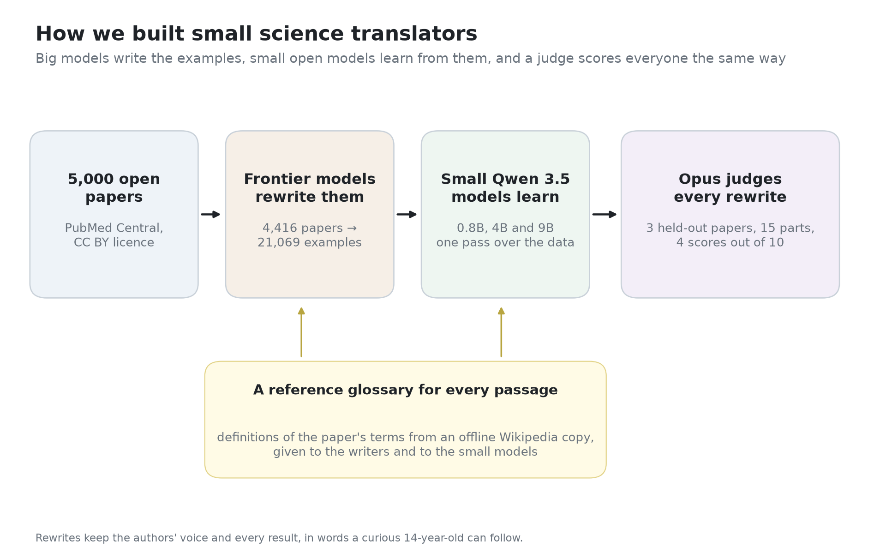

**Caption:** Big models write the examples, small open models learn from them, and one judge scores everyone the same way. A glossary built from an offline copy of Wikipedia gives writers and students the definitions of each paper's terms.

## 2. Instructions matter before anything else

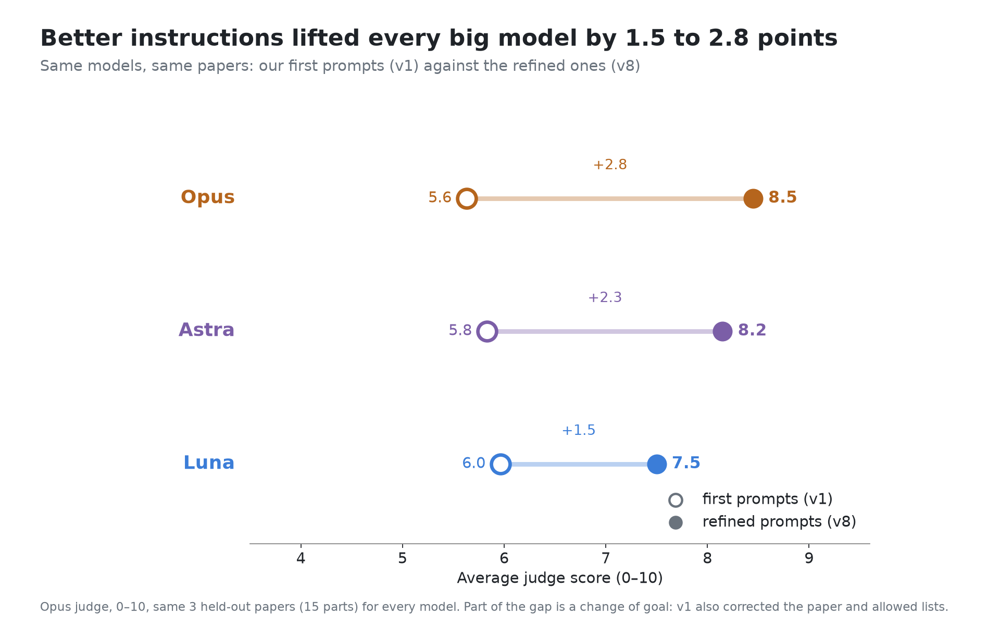

**Caption:** Before training anything, we rewrote the instructions: from 5.6–6.0 to 7.5–8.5. Part of the gain comes from a change of goal (the first prompts also corrected papers and allowed lists).

## 3. Training works at every size

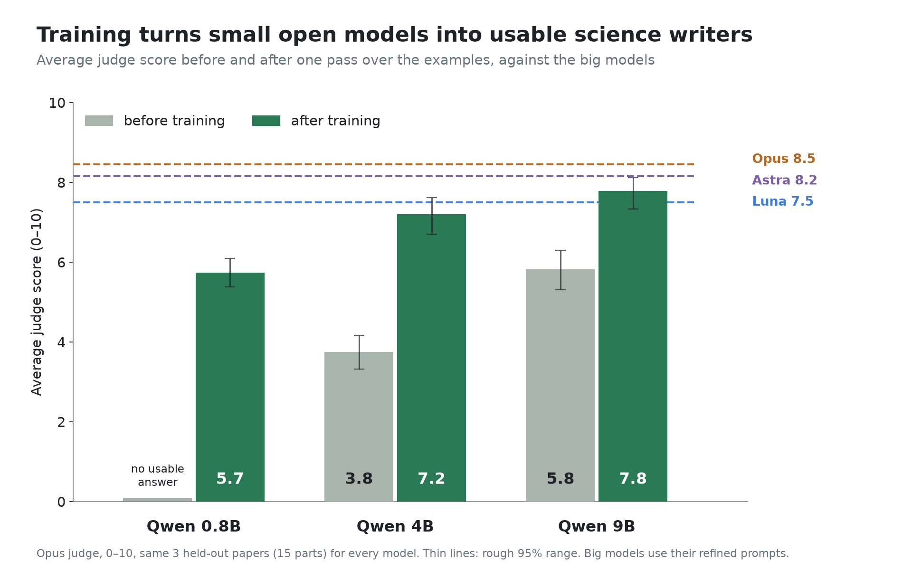

**Caption:** One pass over the examples turns models that can't do the task into usable science writers. The trained 9B (7.8) scores just above Luna (7.5).

## 4. What improves, and what's left

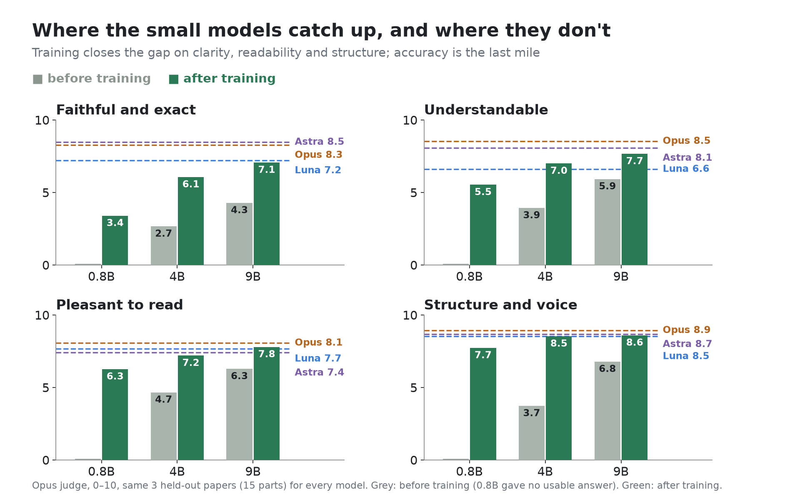

**Caption:** Structure and readability catch up first. Accuracy (keeping every number and claim right) is the last mile.

## 5. The glossary

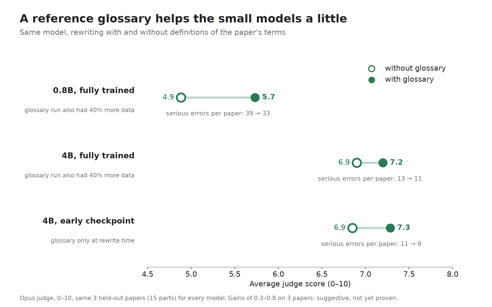

**Caption:** Giving the model definitions of the paper's terms helps a little each time, and removes a few serious errors. The two fully trained comparisons also differ in data (the glossary runs had 40% more), so this is suggestive, not proven.

## 6. When to stop training

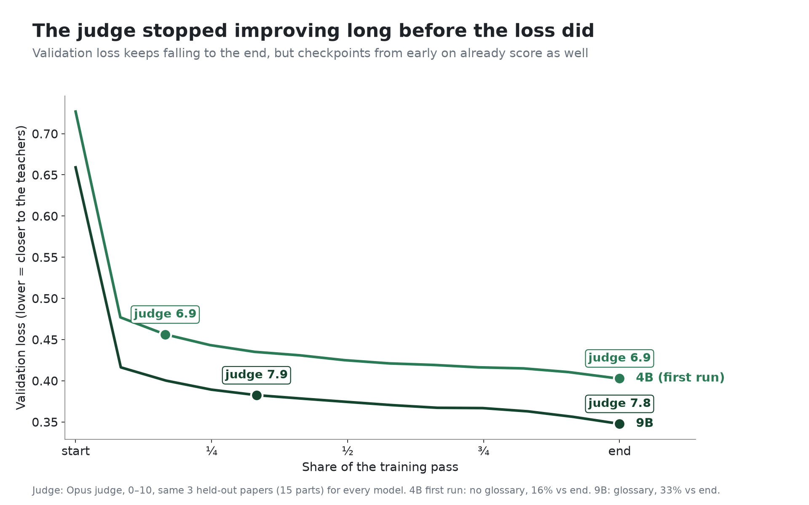

**Caption:** The usual training metric (validation loss) kept improving to the end, but the judge didn't: checkpoints 16% (4B) and 33% (9B) of the way through already scored as well. Most of the training time bought nothing we could measure.

## 7. Quality against price (headline)

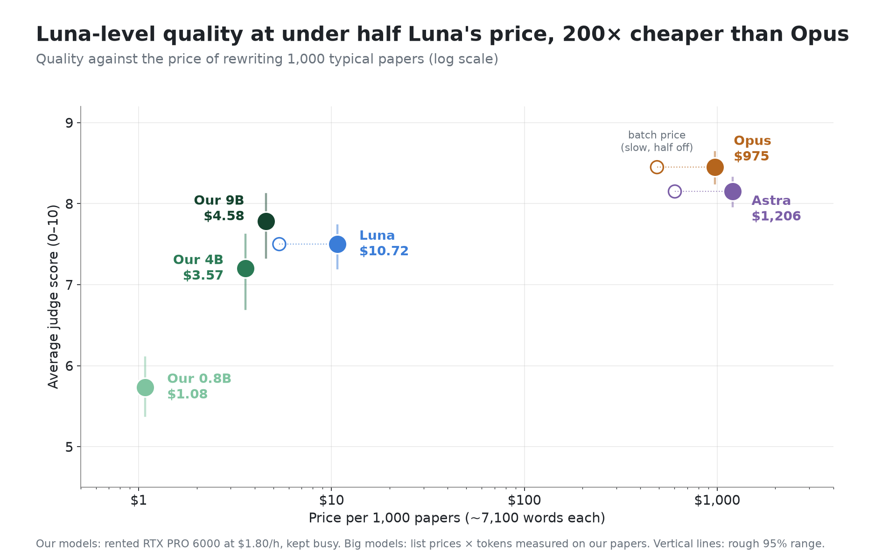

**Caption:** Our 9B scores just above Luna at under half its price, and costs about 200 times less than Opus. Opus and Astra are still more accurate.

## 8. Speed

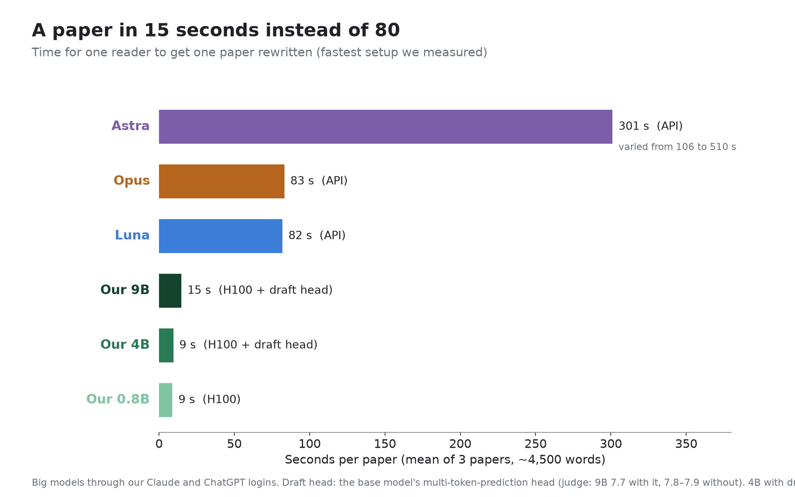

**Caption:** On one rented H100, our 9B rewrites a paper in about 15 seconds. The big models take about 80 seconds (Astra 100–500). The 4B and 9B reach this speed with a "draft head" that guesses a few words ahead; the judge scored the 9B the same with it.

## 9. Which GPU to rent

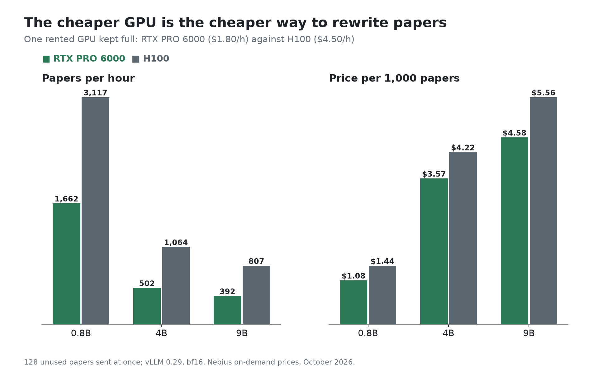

**Caption:** The H100 is about twice as fast, but the RTX PRO 6000 costs 40% as much, so it rewrites each paper 15–25% cheaper.

## 10. When owning beats paying per paper

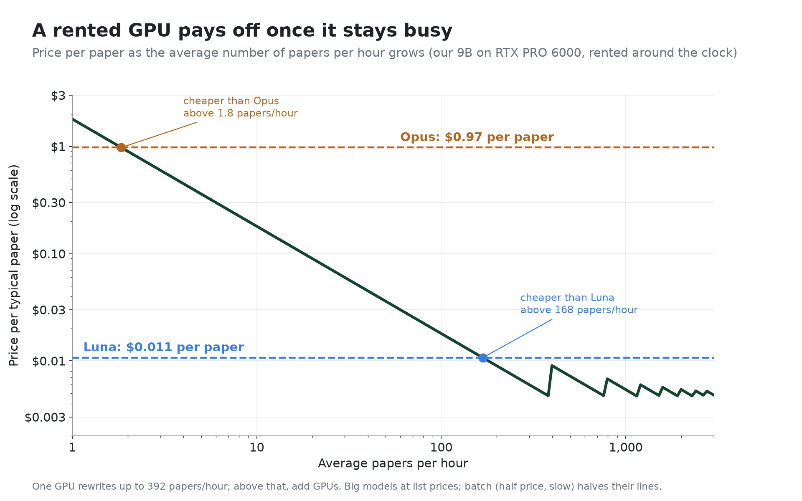

**Caption:** A rented GPU costs the same per hour whether it works or not. It beats Opus almost immediately, but it only beats Luna once it rewrites more than about 170 papers an hour on average.

## 11. Serious mistakes

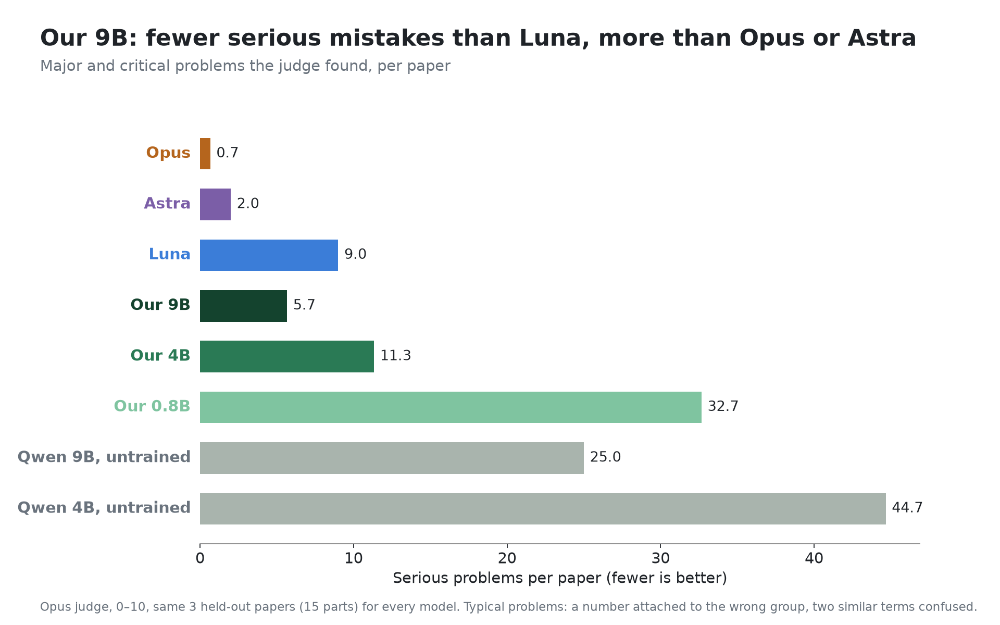

**Caption:** Our 9B makes fewer serious mistakes than Luna, but still several times more than Opus or Astra. The typical ones: a number attached to the wrong group, or two similar terms confused.

## 12. Head to head (headline for quality)

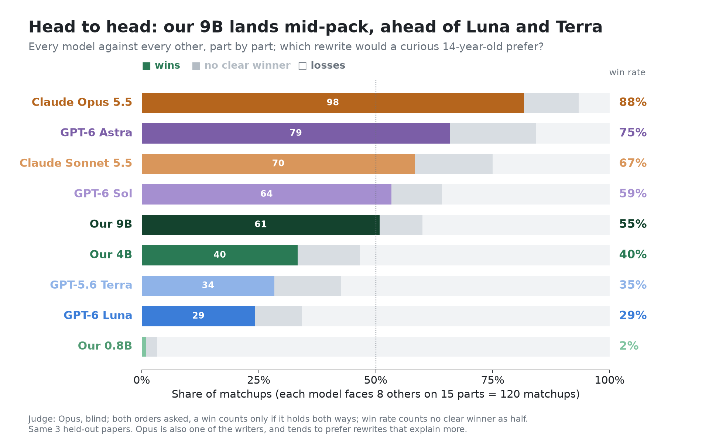

**Caption:** Every model against every other, part by part, judged blind. Our 9B lands in the middle of the pack: behind Opus, Astra, Sonnet and (narrowly) Sol, ahead of Terra and Luna. Opus is also one of the writers and tends to favour rewrites that explain more.

## 13. Who beats whom

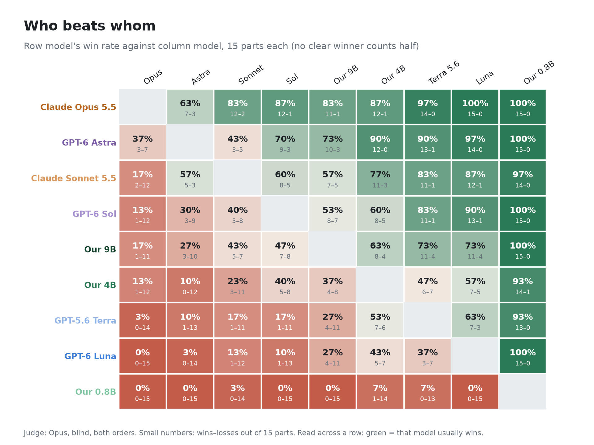

**Caption:** Read across a row: green means that model usually wins. Our 9B's closest contest is with GPT-6 Sol, which costs about 40 times more per paper.

---

## Fine print (for a methods box)

- **Models:** Qwen 3.5 0.8B (all weights), 4B (LoRA), 9B (all weights), one pass over 20,394 training conversations. Big models with their refined (v8) prompts: Claude Opus 5.5, GPT-6 Astra (low reasoning), GPT-6 Luna.
- **Prices:** Nebius on-demand (RTX PRO 6000 $1.80/h, H100 $4.50/h) and API list prices (Opus $4/$20, Astra $10/$50, Luna $0.10/$0.50 per million tokens in/out), October 2026. Our models' price assumes the GPU is kept busy. A "typical paper" is about 7,100 words.
- **Speed:** time for one paper sent alone, mean of 3 papers. Big models went through our Claude and ChatGPT logins; their paid APIs may be faster.
- **Head to head:** 9 writers, 15 parts, every pair asked in both orders (1,080 Opus calls); a win only counts if it holds both ways. A second run with GPT-6 Astra as judge ranked models very differently (it put itself first and Opus sixth), so we report the Opus judge and say so.
- **Not tested:** other GPUs (L40S, B200/B300), 8-bit models, more test papers.
